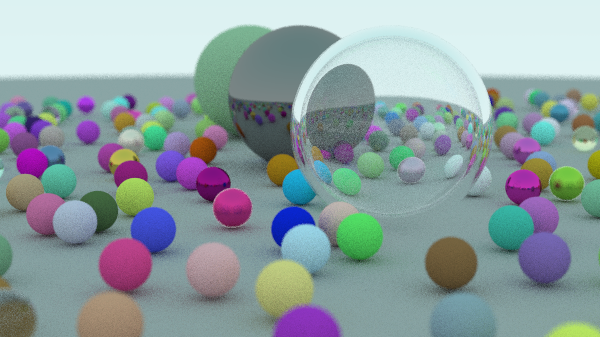
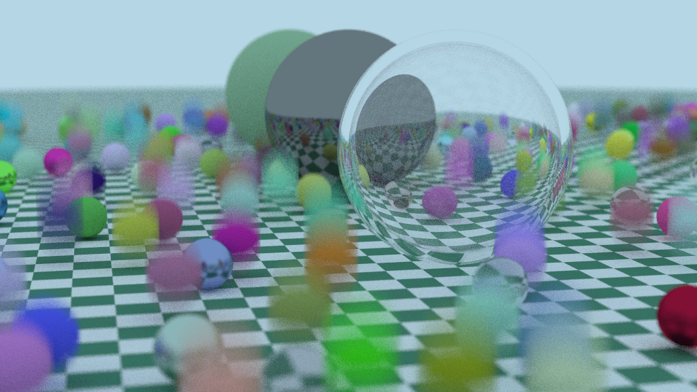
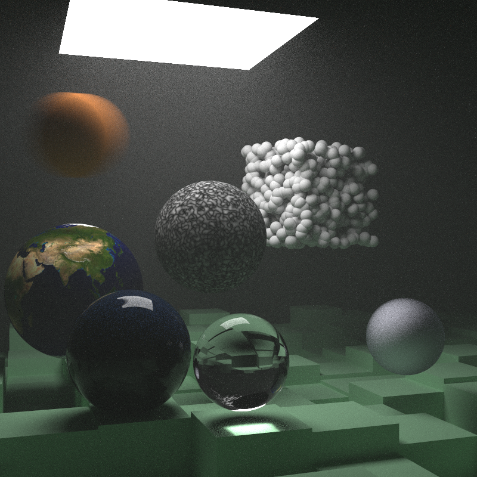
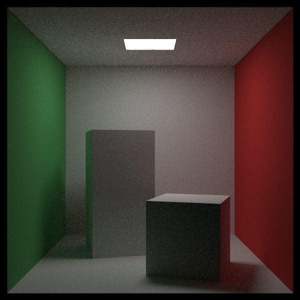
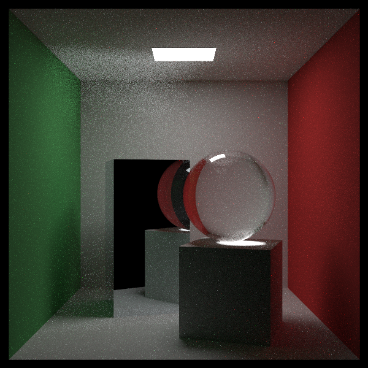
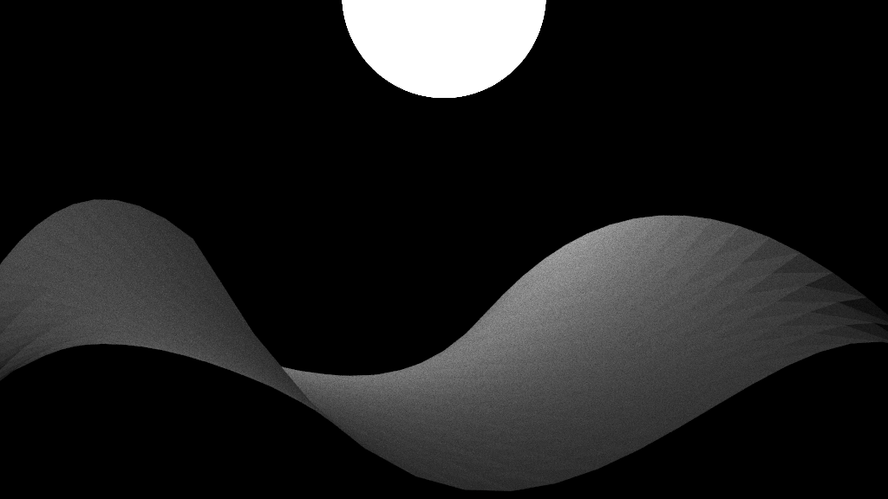

# RayTracer

This will be a project that fully implements a Path Tracer from scratch, following the steps in Peter Shirley's "[Ray Tracing in One Weekend](https://raytracing.github.io/books/RayTracingInOneWeekend.html)" Series, plus some personal additions.

I will be updating this README as I add more features

### Camera configs:
* -h / --help
* --out (output file)
* --bvh (builds a bvh of the scene to decrease render time)
* --display (creates a window that shows the image being) rendered, for now only confirmed to work with Windows
* --scene (select from premade scenes 1-10)
* --aspect_ratio (aspect ratio of the image)
* --width (image width)
* --aa_samples (number of samples per pixel for anti-aliasing, actual number of samples is rounded down to nearest square, as I am doing jittered stratified sampling)
* --max_depth (maximum number of recursive bounces a ray)wil do to determine color before terminating
* --field_of_view (camera field of view)
* --position (camera position)
* --target (camera target)
* --vertical_up ("world" up, editable for the rare case we want the camera to look straight up)
* --defocus_angle (indicates the amount of blur an object will have outside of the area of focus)
* --focus_distance (if defocus angle is non-zero, this sets the area in focus in front of the camera)
* --background (sets background color, should be noted that this counts as a light source)

### Materials:
lambertian, metal, dielectric, isotropic

### Textures:
solid color, checker, image, perlin noise

### Objects:
spheres, quadrilaterals (and boxes), triangles, constant mediums (for gaseous effects), bezier patches

### Math Helpers:
vec3, vec4, mat4, onb, pdf

### Existing Accelerations
top-down BVH tree, threads, light importance sampling

## Future Plans:
* Replace RGB with spectral light scheme for more technically correct lighting.
* Implement GPU for parallizable operations (technically possible to make whole renderer on GPU, may be realistically impossible at this point, but the bezier patch tesselation for example is definitely achievable).
* More shapes: disks, cylinders, bezier tubes
* Background cubemapping
* Switch to a "Linear BVH"

## Some Renders:

